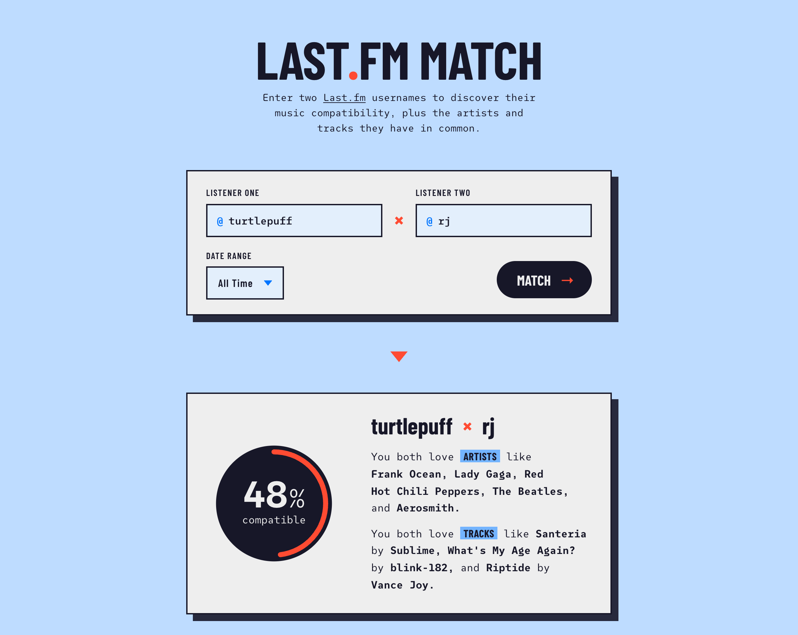
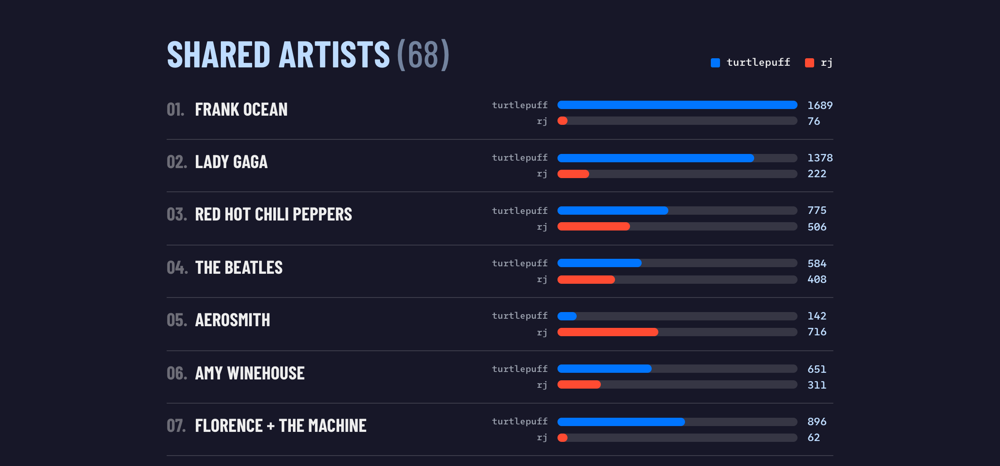

# Last.fm Match

Compare two Last.fm listeners and find out how much their music taste actually
overlaps — a compatibility score, plus every artist and track they share.

**[lastfm-match.netlify.app](https://lastfm-match.netlify.app/)**



## How the score works

The interesting problem here isn't fetching the data, it's deciding what
"compatible" should mean. A few things had to be true:

**Library size shouldn't be punished.** The obvious approach is Jaccard
similarity — shared items divided by total items. But someone with 2,000
scrobbled artists will score badly against a casual listener no matter how
much they genuinely have in common, because the denominator swamps the
overlap. So the score ignores library size entirely.

Instead, for each shared artist it takes **the smaller of the two people's
share of their own listening**:

```js
boost += Math.min(a[item] / totalA, b[item] / totalB)
```

Both people have to actually listen to something for it to count. If one
person plays an artist constantly and the other played them twice, it
contributes about as much as those two plays — which is the honest answer.

**Artists and tracks aren't equally meaningful.** Two people liking the same
artist is common; liking the same *specific track* is rarer and says more. But
because it's rarer, scoring on tracks alone produces depressingly low numbers.
The compromise is a weighted blend:

```js
const combined = artistScore * 0.6 + trackScore * 0.4
```

**Raw overlap scores are tiny.** Even a strong match lands somewhere around
0.05 on the raw scale, and telling two people they're "5% compatible" is
useless. A fourth root stretches the low end into a range that means something
to a human, without changing anyone's *relative* ranking:

```js
Math.round(Math.pow(combined, 1 / 4) * 100)
```

The shared lists are ranked the same way — by each person's share of listening,
not raw playcount — so one heavy listener can't dominate the ordering.



## The API key problem

Last.fm's API needs a key, and the app has no traditional backend — which
raises an obvious question: where does the key live so it doesn't end up in
the browser?

Front-end frameworks make this easy to get wrong. Vite injects environment
variables into the client bundle, but **only ones prefixed `VITE_`**. So the
variable here is deliberately named `LASTFM_API_KEY` with no prefix — that
alone makes it impossible for the key to reach the browser, even if some
future code tried to read it.

The key is read by a single [Netlify Function](netlify/functions/lastfm.js)
that the browser talks to instead of Last.fm. Three details that matter:

- **It allowlists methods.** Without that, a public endpoint holding an API key
  is an open proxy to all of Last.fm for anyone who finds the URL.
- **It forwards Last.fm's status _and_ body unchanged.** Last.fm answers
  "user not found" with a 404 that still carries `{ message, error: 6 }`, and
  the app needs that body to name which username was wrong. Throwing on a
  non-OK response — the intuitive thing to write — silently downgrades a
  helpful error into a generic one.
- **It caches at the edge.** Identical searches collapse onto one upstream
  request. This matters more than usual here: with a proxy, every request
  reaches Last.fm from the same address, so the whole site looks like a single
  client rather than many separate visitors.

## Running it locally

```bash
npm install
npx netlify dev          # http://localhost:8888
```

Use `netlify dev`, **not** `npm run dev`. The latter runs Vite alone, which
doesn't serve the function, so every search 404s.

You'll need a `.env` file with a [Last.fm API key](https://www.last.fm/api/account/create):

```
LASTFM_API_KEY=your_key_here
```

No `VITE_` prefix — see above. For deploys the same variable goes in the
Netlify UI under Site configuration → Environment variables.

| command | what it does |
| --- | --- |
| `npx netlify dev` | Vite + the function on one origin (:8888) |
| `npm run build` | production build |
| `npm run preview` | serve the production build |
| `npm test` | Vitest suite |
| `npm run lint` | ESLint |
| `npm run og` | re-render `public/og.png` from `design/og.html` |

## Testing

`npm test` covers `src/lib/` — the scoring math, error mapping, pagination and
URL building. That scope is deliberate: those are pure functions, so they test
in milliseconds without a browser, and they're where a bug would be both
likely and invisible. Components are verified by using the app.

That split earns itself regularly. A bug where every server-side failure
printed its error message twice survived precisely because it lived in a hook
rather than in `lib/` — moving it into a tested module was the fix.

## Accessibility

Audited against WCAG 2.1 AA and scoring 100 in Lighthouse, but the more useful
work was in the states an automated scan never reaches — a page audit only ever
sees the empty form, not the results. Driving the app into each state and
auditing there caught a contrast failure affecting 500 rows that the load-time
score reported as perfect.

Also handled: results announced to screen readers without re-reading an
animating score, repeated identical errors that produced no DOM change and so
were silently never announced, focus moved to whichever field needs fixing,
and focus-ring colours chosen per surface since no single colour clears 3:1 on
both the light card and the dark panels.

## Built with

React 19, Vite 7, Sass, Vitest, and a Netlify Function. No component library,
no charting library — the bar charts, score ring and loading animation are all
hand-rolled CSS and SVG.

## Credits

Music data from the [Last.fm API](https://www.last.fm/api). Artist, track and
listener names link back to their Last.fm pages, per the
[API Terms of Service](https://www.last.fm/api/tos).

Built by [Camryn](https://www.camrynpearson.com/).
